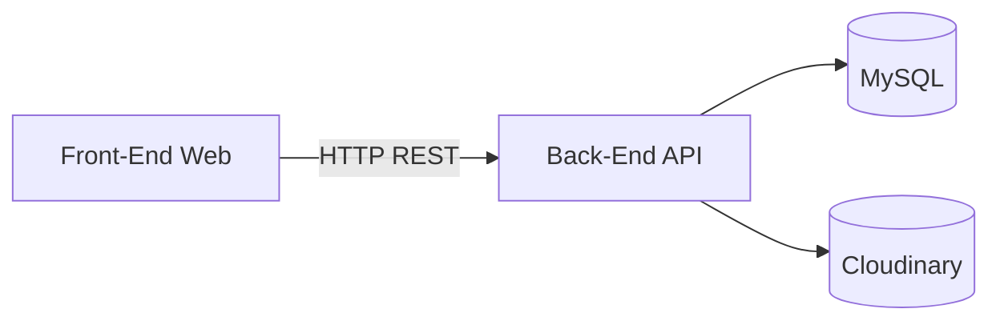
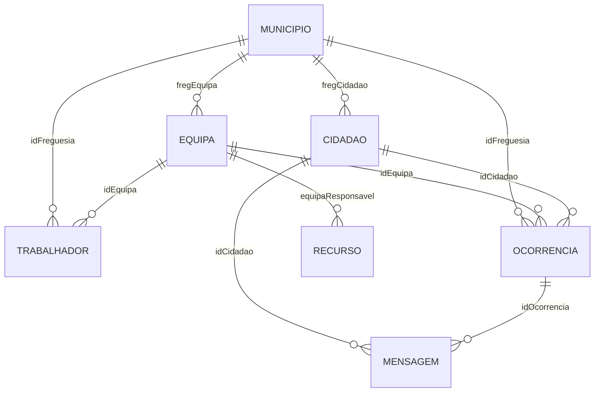

# projeto-2


## Links rapidos

- Front-End: Front-End/front-end
- Back-End: Back-End
- Gerador de Dados: Data-Generator

## Sobre o projeto

Plataforma municipal para reporte e gestao de ocorrencias. Os cidadaos submetem problemas com fotos e acompanham o estado. As equipas tecnicas e administradores resolvem ocorrencias, gerem recursos e mantem a informacao centralizada sobre municipios, equipas, trabalhadores e mensagens.

## Objetivos

- Simplificar o reporte de problemas no espaco publico.
- Dar visibilidade ao estado das ocorrencias.
- Apoiar a operacao das equipas tecnicas.
- Reunir dados para analise e melhoria continua.

## Funcionalidades principais

- Registo e autenticacao de perfis (cidadao e trabalhador).
- Criacao e gestao de ocorrencias com fotos.
- Atualizacao de estados e feedback de resolucao.
- Gestao de equipas, recursos e mensagens.

## Arquitetura geral



## Arquitetura da base de dados (MySQL)

### Entidades principais

- Municipio: freguesia e dados do responsavel.
- Cidadao: dados de utilizador e freguesia associada.
- Equipa: especializacao e freguesia associada.
- Trabalhador: dados do trabalhador e relacao com equipa e freguesia.
- Recurso: meios e estado associados a uma equipa.
- Ocorrencia: descricao, localizacao, estado, fotos e relacoes principais.
- Mensagem: comunicacao ligada a cidadao e ocorrencia.

### Relacoes

- Municipio 1..N Cidadao (fregCidadao)
- Municipio 1..N Equipa (fregEquipa)
- Municipio 1..N Trabalhador (idFreguesia)
- Municipio 1..N Ocorrencia (idFreguesia)
- Equipa 1..N Trabalhador (idEquipa)
- Equipa 1..N Recurso (equipaResponsavel)
- Equipa 1..N Ocorrencia (idEquipa)
- Cidadao 1..N Ocorrencia (idCidadao)
- Cidadao 1..N Mensagem (idCidadao)
- Ocorrencia 1..N Mensagem (idOcorrencia)



## Componentes do projeto

### Back-End

- API REST com autenticacao por token.
- Gestao de ocorrencias, fotos, estados, equipas, recursos e mensagens.
- Integracao com Cloudinary para armazenamento de imagens.
- Persistencia em MySQL com Sequelize.

### Front-End

- Interface web para cidadaos, trabalhadores e administradores.
- Fluxo de criacao, consulta e detalhe de ocorrencias.
- Galeria de fotos por ocorrencia.
- Vistas dedicadas por perfil.

### Geracao de dados

- Scripts Python para gerar dados sinteticos realistas.
- Seeds para freguesias, tipos de ocorrencia e equipas.
- Exportacao para JSON em Data-Generator/data.
- Suporte para popular a base de dados em desenvolvimento.

## Stack tecnologica

| Camada | Tecnologias |
| --- | --- |
| Back-End | Node.js, Express, Sequelize, MySQL, JWT, Cloudinary |
| Front-End | Vue 3, Vite, Vue Router, Pinia |
| Geracao de dados | Python, Faker |

## Estrutura do repositorio

- Back-End: API, modelos e configuracoes.
- Front-End/front-end: aplicacao web.
- Data-Generator: geracao e seeds de dados.

## Configuracao e execucao

### Requisitos

- Node.js 18+
- MySQL 8+
- Python 3.10+

### Back-End

1) Criar .env em Back-End/:

```
DB_NAME=projeto2
DB_USER=root
DB_PASSWORD=your_password
DB_HOST=localhost
DB_PORT=3306
DB_DIALECT=mysql
HOST=127.0.0.1
PORT=3000
DB_SYNC=false
DB_SYNC_FORCE=false

CLOUDINARY_CLOUD_NAME=your_cloud_name
CLOUDINARY_API_KEY=your_api_key
CLOUDINARY_API_SECRET=your_api_secret
```

2) Instalar e arrancar:

```
cd Back-End
npm install
npm run dev
```

### Front-End

1) (Opcional) Criar Front-End/front-end/.env:

```
VITE_API_URL=http://127.0.0.1:3000
```

2) Instalar e arrancar:

```
cd Front-End/front-end
npm install
npm run dev
```

### Geracao de dados

1) Instalar dependencias Python:

```
pip install Faker
```

2) Executar scripts de geracao (exemplos):

- Data-Generator/entities/cidadao/generator.py
- Data-Generator/entities/ocorrencias/generator.py
- Data-Generator/entities/trabalhador/generator.py

3) Seeds auxiliares:

- Data-Generator/database/seeds/seed_freguesias.py
- Data-Generator/database/seeds/seed_tipos_ocorrencia.py
- Data-Generator/database/seeds/seed_equipas.py

## Documentacao da API

A lista completa de rotas e exemplos de resposta esta em Back-End/README.md.

## Equipa

| Nome | Email |
| --- | --- |
| Miguel Caldas | 40240221@esmad.ipp.pt |
| Mariana Ferreira | 40240450@esmad.ipp.pt |
| Pedro Rodrigues | 40240239@esmad.ipp.pt |

## Contexto academico

Projeto interdisciplinar no ambito da:

Licenciatura em Tecnologias e Sistemas de Informacao para a Web
Escola Superior de Media Artes e Design (ESMAD)
Politecnico do Porto

Unidades curriculares envolvidas:

| Unidade curricular | Enfoque |
| --- | --- |
| Engenharia de Software | Arquitetura, modelacao e boas praticas |
| Base de Dados | Modelacao relacional e persistencia |
| Programacao Web II | Back-end e integracao API |
| Projeto II | Gestao do projeto e documentacao |
| Testes e Performance Web | Testes funcionais e desempenho |

Docentes:

- Prof. Doutor Lino Rui dos Santos Oliveira
- Prof. Manuel Jorge de Abreu Antunes Lima
- Prof. Diogo Filipe de Bastos Sousa Ribeiro
- Profa. Ines Sofia Antunes Moura Reis
- Profa. Viviana da Costa Neto Henriques
- Profa. Doutora Teresa Cristina de Sousa Azevedo Terroso
- Prof. Antonio Francisco da Costa Machado